# 🗳️ Voting System

Voting System is an application built with **Golang (Gin Framework)** and **PostgreSQL** for creating, managing, and participating in online voting.  
This project supports user authentication, poll creation, option selection, and vote data management.

---

## 📌 Key Features
- **Authentication & Authorization**
  - User registration and login.
  - API protection using JWT.
- **Poll Management**
  - Create new polls with title, description, and expiration date.
  - Add multiple poll options.
  - Enable/disable polls.
- **Voting**
  - Users can select one option in active polls.
  - Prevent duplicate votes for the same poll.
- **Reports & Statistics**
  - Count votes for each option.
  - Display poll results in real time.

---

## 🛠️ Technologies Used
- **Backend**: [Golang](https://go.dev/) + [Gin Web Framework](https://gin-gonic.com/)
- **Database**: [PostgreSQL](https://www.postgresql.org/)
- **ORM**: [GORM](https://gorm.io/)
- **Authentication**: JSON Web Token (JWT)
- **Frontend**: (Optional) Vue.js or any frontend framework.

---

## 📸 Screenshots
### 🏠 Home

  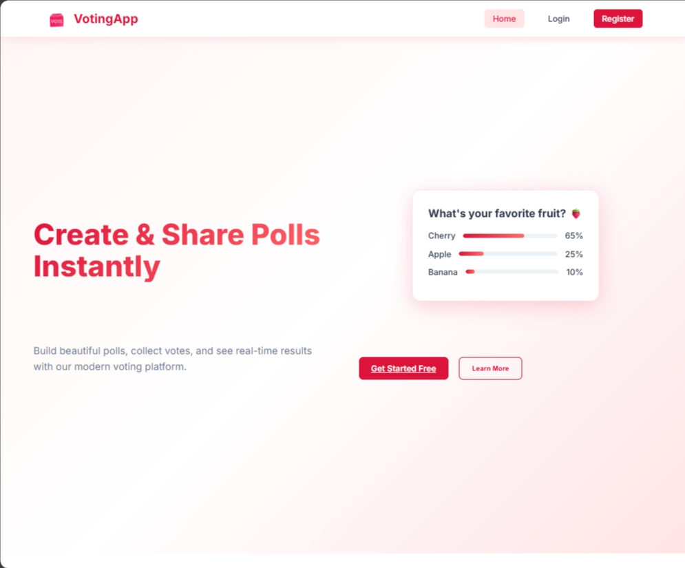
  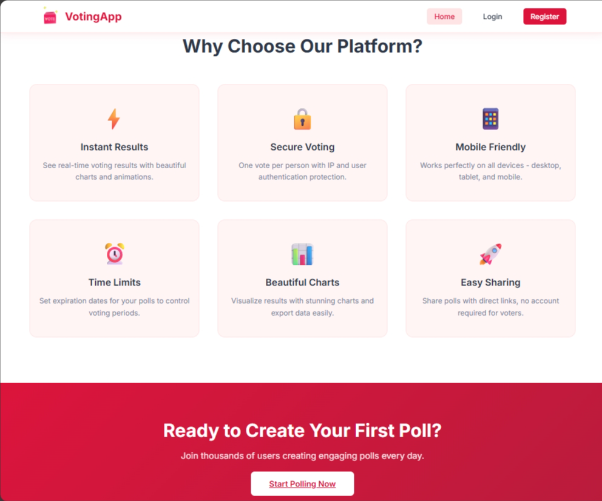
  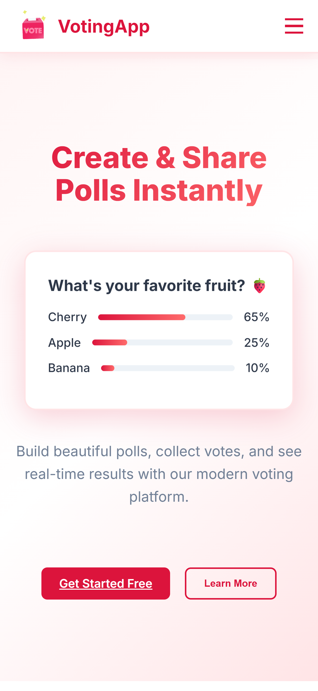

---
### 🔍 Access

  
  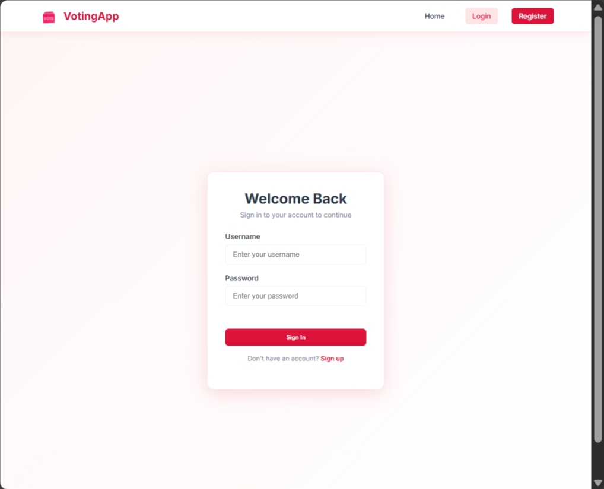
   
  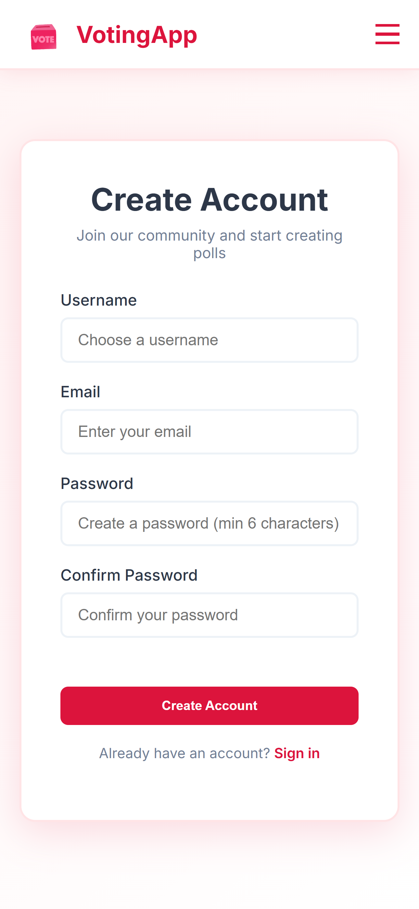
  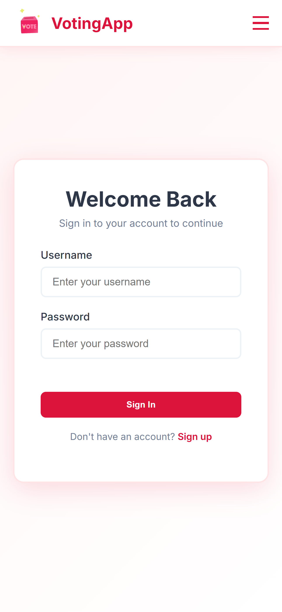

---
### 💭 All Pages

  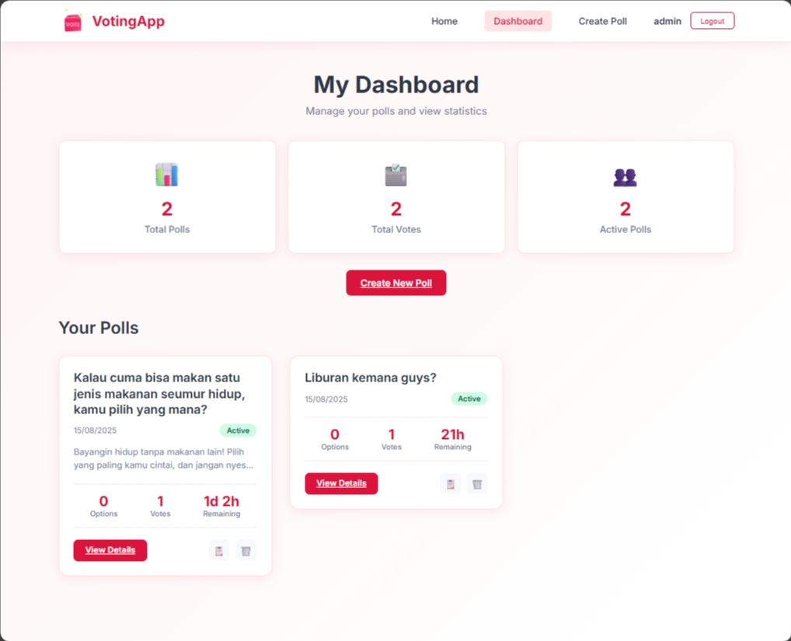
  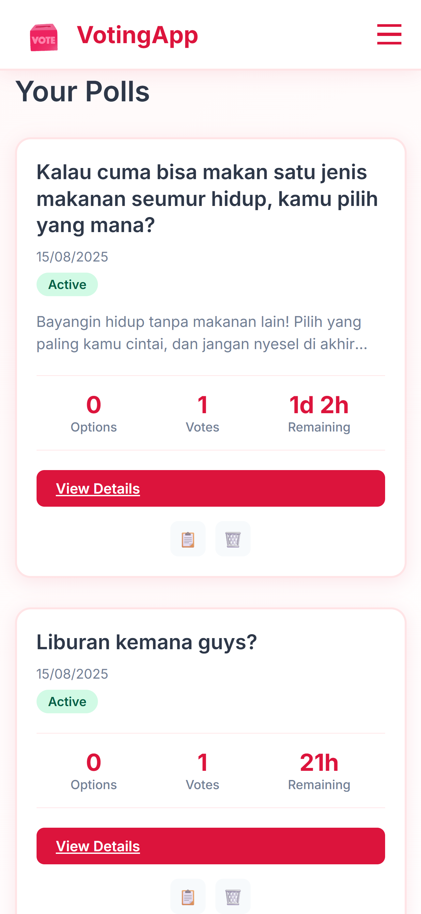
  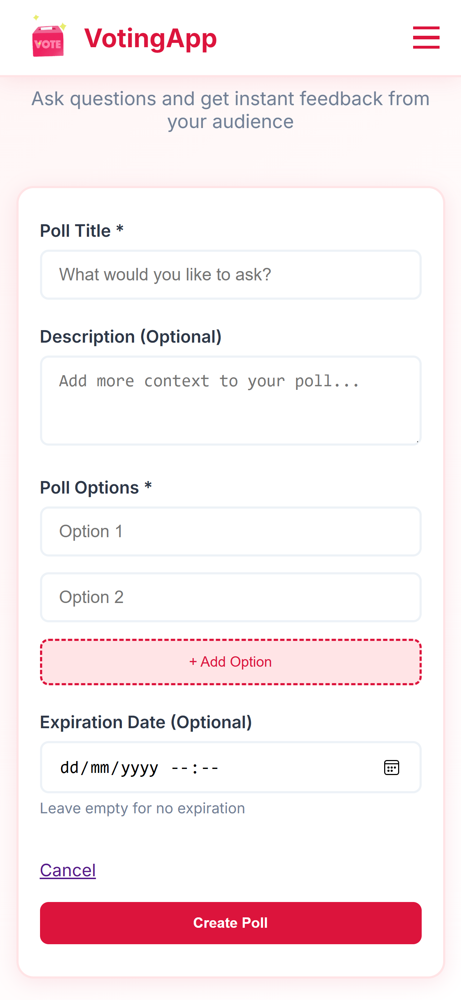
  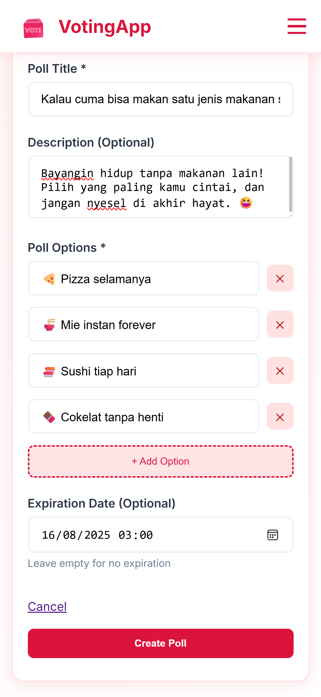
  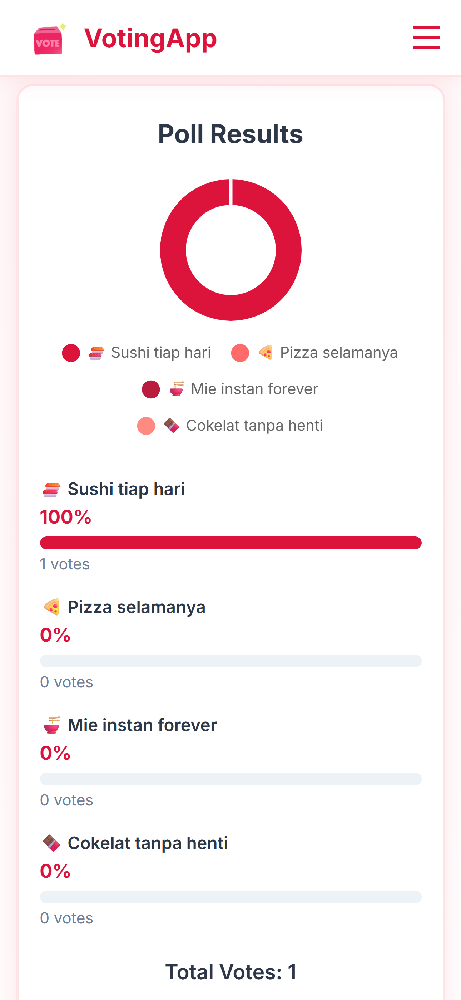

---

## 👩‍💻 About the Developer

By **Dewi Atika Muthi**  
📍 _Informatics Student, Telkom University_  
📧 **Email:** detikaa10@fmail.com  
🌐 **GitHub:** [@tikature](https://github.com/tikature)  

💬 *"Code with clarity, build with passion."*

