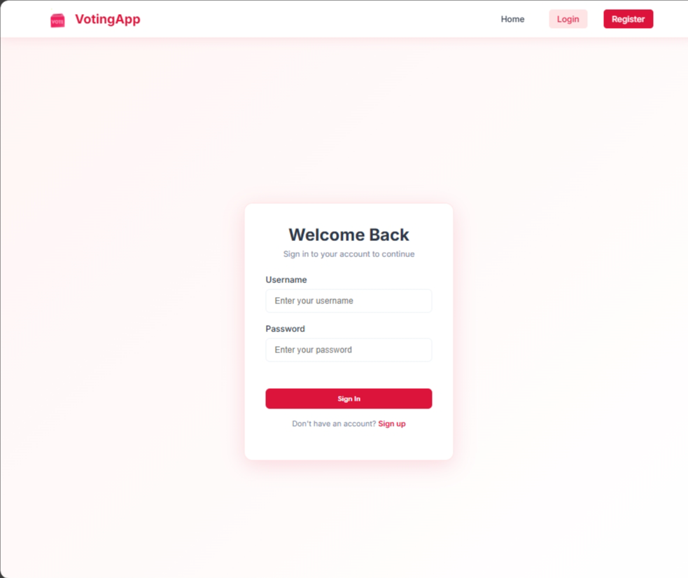

# 🗳️ Voting System

Voting System adalah aplikasi berbasis **Golang (Gin Framework)** dan **PostgreSQL** yang digunakan untuk membuat, mengelola, dan mengikuti voting secara online. Proyek ini mendukung autentikasi pengguna, pembuatan polling, pemilihan opsi, dan pengelolaan data voting secara aman.

---

## 📌 Fitur Utama
- **Autentikasi & Otorisasi**
  - Login dan registrasi pengguna.
  - Proteksi API dengan JWT.
- **Manajemen Polling**
  - Buat polling baru dengan judul, deskripsi, dan batas waktu.
  - Tambahkan beberapa pilihan (poll options).
  - Aktif/nonaktifkan polling.
- **Voting**
  - Pengguna dapat memilih satu opsi pada polling aktif.
  - Cegah voting ganda untuk polling yang sama.
- **Laporan & Statistik**
  - Hitung jumlah suara untuk setiap opsi.
  - Tampilkan hasil polling secara real-time.

---

## 🛠️ Teknologi yang Digunakan
- **Backend**: [Golang](https://go.dev/) + [Gin Web Framework](https://gin-gonic.com/)
- **Database**: [PostgreSQL](https://www.postgresql.org/)
- **ORM**: [GORM](https://gorm.io/)
- **Autentikasi**: JSON Web Token (JWT)
- **Frontend**: (Opsional) Vue.js atau framework frontend lainnya.

---

## 📸 Cuplikan Tampilan (Screenshots)
### 🏠 Home

  
  
  

---
### 🔍 Akses

  
  
  
  

---
### 💭 All

  
  
  
  
  

---
## 👩‍💻 Tentang Pengembang

By **Dewi Atika Muthi**  
📍 _Informatics Student, Telkom University_  
📧 **Email:** detikaa10@fmail.com  
🌐 **GitHub:** [@tikature](https://github.com/tikature)  

